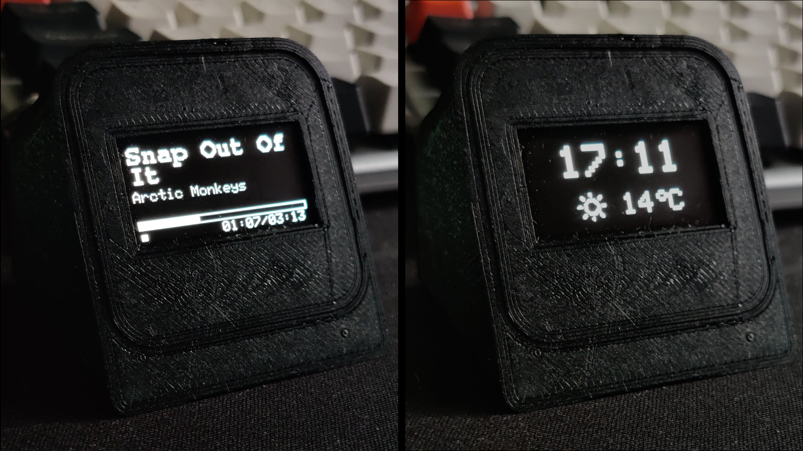

# ESP8266/ESP32 Spotify OLED Display

This project displays current Spotify playback information and weather data on an OLED display using an ESP8266 or ESP32.




## 🎵 Features

- Shows current Spotify track information including:
  - Song title
  - Artist(s)
  - Progress bar
  - Play/pause status
  - Elapsed/total time
- When no music is playing, displays:
  - Current time
  - Current temperature
  - Weather icon

## 📋 Requirements

### Hardware
- ESP8266 or ESP32 (ex.: D1 Mini)
- SH1106 OLED Display (128x64)

### Connections
- OLED SDA -> D1
- OLED SCL -> D2
- VCC -> 3.3V
- GND -> GND

### Arduino Libraries
Install the following libraries from the Arduino Library Manager:

- Spotify API Arduino [(repo)](https://github.com/witnessmenow/spotify-api-arduino.git)
- Adafruit GFX Library - 1.10.9+ [(repo)](https://github.com/adafruit/Adafruit-GFX-Library)
- Adafruit SH110X - 2.1.10+ [(repo)](https://github.com/adafruit/Adafruit_SH110X.git)
- ArduinoJson - 6.21.x [(docs)](https://arduinojson.org/v6/doc/installation/)

You can install the libraries using the Arduino IDE Library Manager (Tools > Manage Libraries...) except for `Spotify API Arduino` which you need to install manually, download the [library repository](https://github.com/witnessmenow/spotify-api-arduino.git) as a ZIP and install it as an external library (Sketch > Include Library > Add .ZIP Library...).

### Spotify API Credentials

To get your Spotify API credentials, follow these steps:

1. Create a Spotify Developer Account:
   - Go to [Spotify Developer Dashboard](https://developer.spotify.com/dashboard)
   - Log in with your Spotify account or create one
   - Accept the Terms of Service

2. Create a new Application:
   - Click "Create an App" 
   - Fill in the App name and description
   - Accept the Terms of Service
   - Click "Create"

3. Get Client ID and Client Secret:
   - Once created, you'll see your Client ID on the dashboard
   - Click "Show Client Secret" to reveal your Client Secret
   - Save both values, you'll need them for `secrets.h`

4. Get Refresh Token:
   - Visit the [Spotify Auth Token Generator](https://spotify-refresh-token-generator.netlify.app/)
   - Enter your Client ID and Client Secret
   - Click "Get Refresh Token"
   - Authorize the application when prompted
   - Copy the generated Refresh Token

5. Update `secrets.h`:
   ```cpp
   #define SPOTIFY_CLIENT_ID     "your_client_id_here"
   #define SPOTIFY_CLIENT_SECRET "your_client_secret_here" 
   #define SPOTIFY_REFRESH_TOKEN "your_refresh_token_here"
   ```

### Weather API Credentials

To get your OpenWeatherMap API key, follow these steps:

1. Create an OpenWeatherMap Account:
   - Go to [OpenWeatherMap](https://openweathermap.org/)
   - Click "Sign Up" and create a free account
   - Verify your email address

2. Get your API Key:
   - Log in to your account
   - Go to your profile menu (top right) and click "My API Keys"
   - You'll find your default API key there
   - Or generate a new key by entering a name and clicking "Generate"

3. Update `secrets.h`:
   ```cpp
   #define WEATHER_API_KEY "your_api_key_here"
   ```

## 🔧 How to Compile

1. Install all required libraries as described above

2. In Arduino IDE:
   - Select your board:
     - For ESP8266: Tools > Board > ESP8266 Boards > [Your ESP Board]
     - For ESP32: Tools > Board > ESP32 Arduino > [Your ESP Board]

3. Create the required configuration files:
   - Update `secrets.h` with your WiFi, Spotify and Weather API credentials

4. Verify library dependencies:
   ```cpp
   #include <SpotifyArduino.h>
   #include <SpotifyArduinoCert.h>
   #include <Adafruit_SH110X.h>
   ```
   If you see any errors, double-check that all libraries are properly installed

5. Connect your ESP8266/ESP32 to your computer

6. Select the correct port in Arduino IDE:
   - Tools > Port > [Your ESP Port]

7. Click the "Upload" button or use Sketch > Upload

8. Monitor the upload process in the IDE's console
