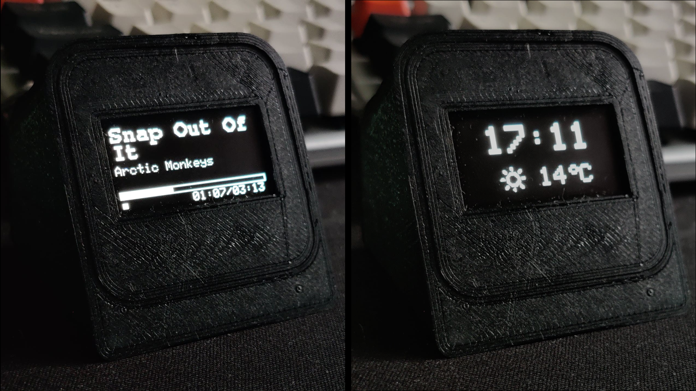

# ESP8266/ESP32 Spotify OLED Display

This project displays current Spotify playback information and weather data on an OLED display using an ESP8266 or ESP32.




## 🎵 Features

- Shows current Spotify track information including:
  - Song title
  - Artist(s)
  - Progress bar
  - Play/pause status
  - Elapsed/total time
- When no music is playing, displays:
  - Current time
  - Current temperature
  - Weather icon

## 📋 Requirements

### Hardware
- ESP8266 or ESP32 (ex.: D1 Mini)
- SH1106 OLED Display (128x64)

### Connections
- OLED SDA -> D1
- OLED SCL -> D2
- VCC -> 3.3V
- GND -> GND

### Arduino Libraries
Install the following libraries from the Arduino Library Manager:

- Spotify API Arduino [(repo)](https://github.com/witnessmenow/spotify-api-arduino)
- Adafruit GFX Library - 1.10.9 [(repo)](https://github.com/adafruit/Adafruit-GFX-Library)
- Adafruit SH110X - 2.1.10 [(repo)](https://github.com/adafruit/Adafruit_SH110X.git)
- ArduinoJson - 6.21.x [(docs)](https://arduinojson.org/v6/doc/installation/)
- EzTime - 0.8.3 [(repo)](https://github.com/ropg/ezTime)
- ESP_WiFiManager - 1.12.1 [(repo)](https://github.com/khoih-prog/ESP_WiFiManager)

You can install the libraries using the Arduino IDE Library Manager (Tools > Manage Libraries...) except for `Spotify API Arduino` which you need to install manually, download the [library repository](https://github.com/witnessmenow/spotify-api-arduino.git) as a ZIP and install it as an external library (Sketch > Include Library > Add .ZIP Library...).

### Spotify API Credentials

To get your Spotify API credentials, follow these steps:

1. Create a Spotify Developer Account:
   - Go to [Spotify Developer Dashboard](https://developer.spotify.com/dashboard)
   - Log in with your Spotify account or create one
   - Accept the Terms of Service

2. Create a new Application:
   - Click "Create an App" 
   - Fill in the App name and description
   - Accept the Terms of Service
   - Click "Create"

3. Get Client ID and Client Secret:
   - Once created, you'll see your Client ID on the dashboard
   - Click "Show Client Secret" to reveal your Client Secret
   - Save both values, you'll need them for `secrets.h`

4. Get Refresh Token:
   - Visit the [Spotify Auth Token Generator](https://spotify-refresh-token-generator.netlify.app/)
   - Enter your Client ID and Client Secret
   - Leave the Redirect URI as-is
   - Select the following Scopes:
      - user-read-currently-playing
      - user-read-playback-state
   - Click "Get Refresh Token"
   - Authorize the application when prompted
   - Copy the generated Refresh Token

5. Update `secrets.h`:
   ```cpp
   #define SPOTIFY_CLIENT_ID     "your_client_id_here"
   #define SPOTIFY_CLIENT_SECRET "your_client_secret_here" 
   #define SPOTIFY_REFRESH_TOKEN "your_refresh_token_here"
   ```

### Weather API Credentials

To get your OpenWeatherMap API key, follow these steps:

1. Create an OpenWeatherMap Account:
   - Go to [OpenWeatherMap](https://openweathermap.org/)
   - Click "Sign Up" and create a free account
   - Verify your email address

2. Get your API Key:
   - Log in to your account
   - Go to your profile menu (top right) and click "My API Keys"
   - You'll find your default API key there
   - Or generate a new key by entering a name and clicking "Generate"

3. Update `secrets.h`:
   ```cpp
   #define WEATHER_API_KEY "your_api_key_here"
   ```

## 📶 WiFi Configuration

This project uses **WiFiManager** for easy WiFi configuration without hardcoding credentials.

### First Time Setup

1. **Upload the sketch** to your ESP32/ESP8266
2. **The device will start in AP mode** since no WiFi credentials are saved
3. **Connect to the Access Point**:
   - SSID: `ESP-Spotify-XXXXXX` (where XXXXXX is the chip ID)
   - Password: `spotify123`
4. **Open a web browser** and navigate to `http://192.168.4.1`
5. **Configure WiFi**:
   - Click "Configure WiFi"
   - Select your WiFi network from the list
   - Enter your WiFi password
   - (Optional) Configure timezone and weather location
   - Click "Save"
6. **The device will reboot** and connect to your WiFi network

### Subsequent Boots

The device will automatically connect to the saved WiFi network. If the connection fails, it will start the configuration portal again.

### Reset WiFi Settings

To reset WiFi credentials and reconfigure:

1. **Connect a button** between pin D3 and GND (or short D3 to GND)
2. **Hold the button while powering on** the device
3. **Keep holding for 3 seconds** until the display shows "Resetting WiFi!"
4. **The device will restart** in AP mode for reconfiguration

You can change the reset button pin in `config.h` by modifying `RESET_BUTTON_PIN`.

### Custom Parameters

The configuration portal also allows you to set:
- **Timezone**: Used for displaying local time (e.g., `Europe/Madrid`, `America/New_York`)
- **Weather Location**: Used for weather data (e.g., `Madrid,ES,city`, `London,UK,city`)

These settings are saved to the filesystem and persist across reboots.

## 🔧 How to Compile

1. Install all required libraries as described above

2. In Arduino IDE:
   - Select your board:
     - For ESP8266: Tools > Board > ESP8266 Boards > [Your ESP Board]
     - For ESP32: Tools > Board > ESP32 Arduino > [Your ESP Board]

3. Create the required configuration files:
   - Update `secrets.h` with your Spotify and Weather API credentials (WiFi is now configured via captive portal)
   - Update `config.h` with your Spotify country market code (timezone and weather location can be configured via captive portal)

4. Verify library dependencies:
   ```cpp
   #include <SpotifyArduino.h>
   #include <SpotifyArduinoCert.h>
   #include <Adafruit_SH110X.h>
   #include <ezTime.h>
   ```
   If you see any errors, double-check that all libraries are properly installed

5. Connect your ESP8266/ESP32 to your computer

6. Select the correct port in Arduino IDE:
   - Tools > Port > [Your ESP Port]

7. Click the "Upload" button or use Sketch > Upload

8. Monitor the upload process in the IDE's console

## 📦 3D Model

You can find the 3D model used for this project [here](https://www.printables.com/model/1098419-terminal-for-ssd1106-13-oled-remix).

## 🛠️ Troubleshooting

If you encounter issues while using the ESP8266/ESP32 Spotify OLED Display, here are some common problems and their solutions:

1. **WiFi Configuration Portal Not Appearing**:
   - Make sure you're connecting to the correct AP (ESP-Spotify-XXXXXX)
   - Try forgetting the network on your device and reconnecting
   - Check that the AP password is `spotify123`
   - Wait up to 2 minutes for the portal to fully initialize

2. **Cannot Connect to Saved WiFi**:
   - The device will automatically start the config portal if connection fails
   - Use the reset button (hold D3 to GND for 3 seconds on boot) to clear settings
   - Check that your WiFi network is 2.4GHz (ESP8266/ESP32 don't support 5GHz)

3. **Reset Button Not Working**:
   - Ensure the button is connected between D3 and GND
   - Hold the button BEFORE powering on, then keep holding for 3 seconds
   - Check the serial monitor for "Reset button pressed" message
   - Verify `RESET_BUTTON_PIN` in `config.h` matches your wiring

4. **OLED Display Not Turning On**:
   - Ensure that the connections (SDA, SCL, VCC, GND) are correct and secure.
   - Check if the OLED display is powered properly.

5. **Spotify API Credentials Not Working**:
   - Double-check that you have entered the correct Client ID, Client Secret, and Refresh Token in `secrets.h`.
   - Ensure that the application has the necessary permissions and scopes enabled.

6. **Weather Data Not Displaying**:
   - Verify that your OpenWeatherMap API key is correct and active.
   - Check your internet connection; the ESP8266/ESP32 needs to be connected to WiFi to fetch weather data.
   - Verify the weather location format in the config portal (e.g., `Madrid,ES,city`)

7. **Compilation Errors**:
   - Make sure all required libraries are installed correctly, including ESP_WiFiManager.
   - Check for any typos in your code or configuration files.

8. **No Music Playing Information**:
   - Ensure that the Spotify account is active and that the device is playing music.
   - Verify that the correct scopes are set in the Spotify API settings.

9. **Token too long error**:
   - This error may occur if you have selected too many scopes when generating the Spotify refresh token.
   - Re-generate the refresh token selecting only the required scopes (user-read-currently-playing and user-read-playback-state)
   - The generated refresh token should be around 130-140 chars long

10. **Filesystem Errors**:
    - If you see "Failed to mount filesystem" errors, the device will automatically format the filesystem
    - Custom settings (timezone, weather location) will be reset to defaults after formatting
